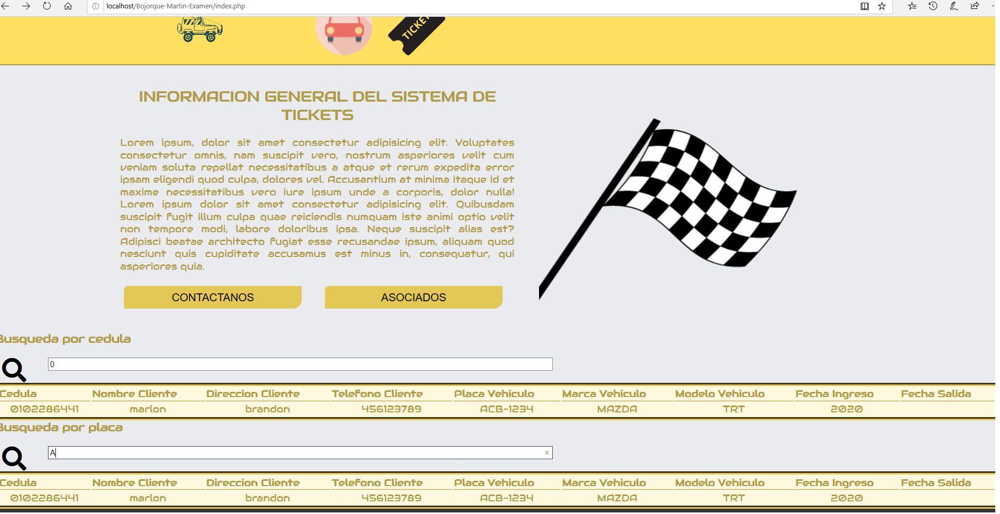
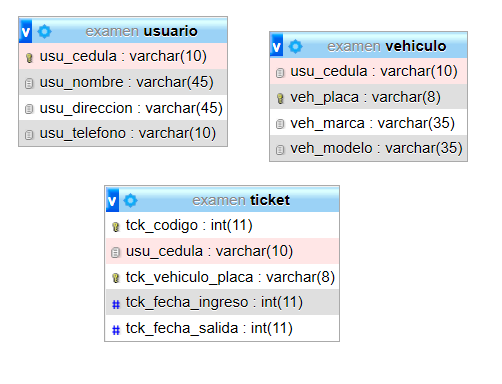
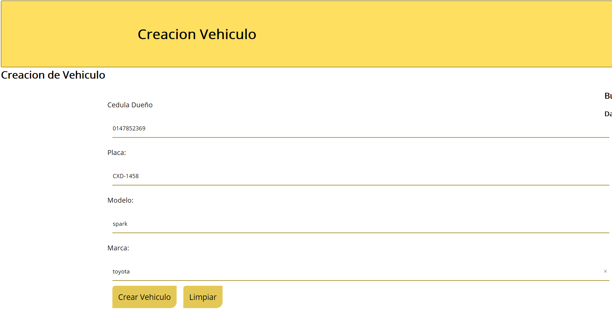
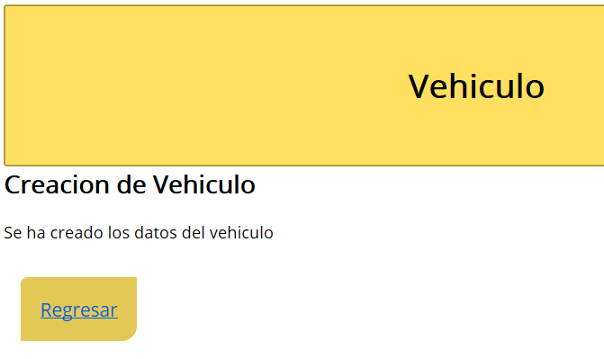
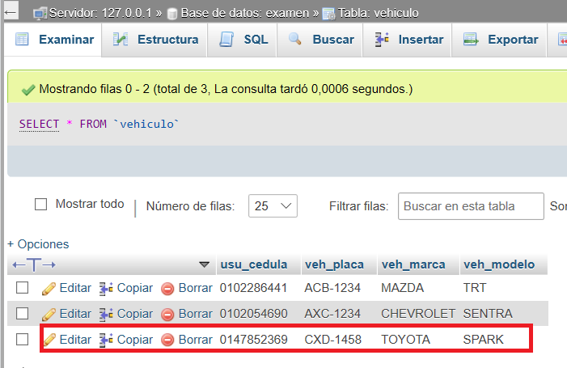
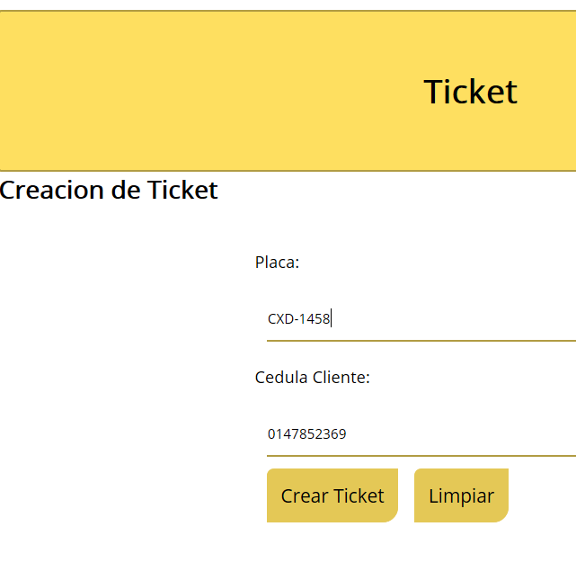
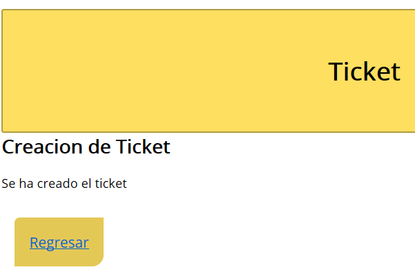
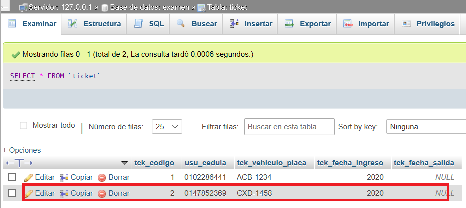

# Bojorque-Martin-Examen
## Creacion de Una pagina Web con Informacion sobre un parqueadero y su funcionamiento

En la imagen anterior se observa la busqueda de los tickets generados, con la informacion adicional de el cliente y el vehiculo.
Adicionalmente se observa la implementacion de HTML y CSS

Se presenta el diseño de la base de datos, con cada una de las tablas utilizadas

### Creacion de un Vehiculo

En la pagina se ingresa la informacion necesaria para la generacion del vehiculo dentro de la base de datos
Adicionalmente se observa la implementacion de HTML y CSS

Se muestra el mensaje obtenido por parte del sistema

Se verifica su creacion

### Creacion de un ticket

Se muestra la creacion de un ticket con la informacion necesaria para su creacion
Adicionalmente se observa la implementacion de HTML y CSS

Se muestra el mensaje obtenido por parte del sistema

